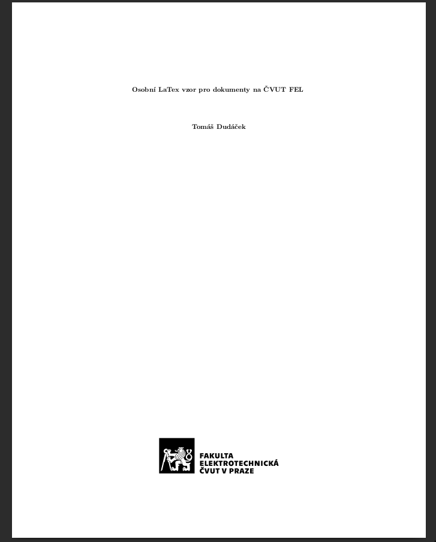
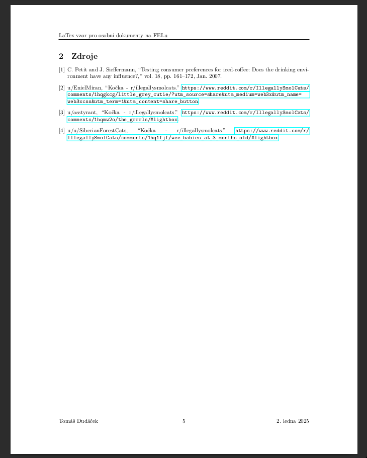

# Vzorový LaTex dokument (v češtině) pro osobní účely na ČVUT FEL

Template na laborky, semestrálky, projekty,... feel free to use.

Obsahuje:
- Titulní stranu
- Generování obsahu
- "Fancy" header
- Vzor na "figures"
- ...
- Správu zkratek
- Správu citací
- Kočky
- Makefile

# TODO
- code blocks

